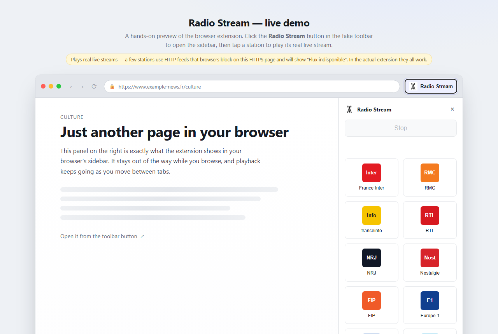

# Radio Stream

Browser extension to play popular French live radio streams from the browser sidebar.
Chrome / Chromium and Firefox use the browser sidebar so playback remains integrated and
stoppable without focusing a hidden player tab.

[](https://github.com/jmicaux/radio-stream/actions/workflows/ci.yml)     

**🔗 Live preview: [jmicaux.github.io/radio-stream](https://jmicaux.github.io/radio-stream/)**



If you enjoy this extension, you can support it:

[](https://buymeacoffee.com/jmicaux)

## Features

- **Sidebar playback** — play popular French live radio stations directly from the browser
  sidebar; the `Stop` button stops the current stream.
- **One-click tiles** — each tile starts or stops the live audio stream; the `Site` link
  opens the station website in a new tab.
- **Usage-based ordering** — stations are sorted locally (saved with `storage.local`): the
  radios you play most appear first, with ties resolved by most recent use, then ACPM rank.

### Supported stations

- France Inter
- RMC
- franceinfo
- RTL
- NRJ
- Nostalgie
- FIP
- Europe 1
- Skyrock
- ici
- Chérie FM
- RFM
- France Culture
- Rire et Chansons
- RTL2
- Radio Classique
- Europe 2
- Fun Radio
- Radio FG
- France Musique
- Sud Radio
- Oui FM
- Radio Nova
- Chante France
- BFM Radio
- Jazz Radio
- Générations
- Outre-Mer la 1ère
- RCI Guadeloupe
- BFM Business

## Download

Grab the latest packaged build from the [releases page](https://github.com/jmicaux/radio-stream/releases/latest):

- **Chrome / Chromium:** [radio-stream-extension-chrome.zip](https://github.com/jmicaux/radio-stream/releases/download/v0.3.4/radio-stream-extension-chrome.zip)
- **Firefox:** [radio-stream-firefox-v0.3.4.xpi](https://github.com/jmicaux/radio-stream/releases/download/v0.3.4/radio-stream-firefox-v0.3.4.xpi) — or the [.zip variant](https://github.com/jmicaux/radio-stream/releases/download/v0.3.4/radio-stream-firefox-v0.3.4.zip) if your browser tries to install the `.xpi` directly instead of downloading it.

## Install & usage

### Firefox

1. Open `about:debugging#/runtime/this-firefox`.
2. Click `Load Temporary Add-on...`.
3. For source testing, select `manifest.firefox.json` from this project folder.
4. For packaged testing, use `dist/v0.3.4/firefox/radio-stream-extension-firefox.zip`.

The Firefox add-on is distributed through [addons.mozilla.org](https://addons.mozilla.org/) (AMO), which handles updates.

### Chrome / Chromium

1. Open `chrome://extensions`.
2. Enable `Developer mode`.
3. Click `Load unpacked`.
4. Select this project folder.
5. For packaged testing, use `dist/v0.3.4/chrome/radio-stream-extension-chrome.zip`.

Chrome release artifacts are mirrored in `releases/v0.3.4/chrome/` for symmetry with Firefox.

## Project structure

```
radio-stream/
├── manifest.json            # Chrome/Chromium manifest (MV3)
├── manifest.firefox.json    # Firefox manifest (MV3)
├── background.js            # service worker: stream control, usage sorting
├── offscreen.html/.js       # offscreen document for audio playback
├── sidebar.html/.js         # sidebar UI
├── popup.css               # shared styles
├── assets/                 # icons
├── dist/ , releases/       # packaged builds and self-hosted update artifacts
└── README.md
```

## Data sources

- The station list follows the top 30 ACPM Radio Brands France ranking (April 2026).
- `ici` and `Outre-Mer la 1ère` are ACPM brand aggregates, so the extension uses
  representative live streams for those brands.
- Each station plays its own public live stream directly rather than opening its website
  player page.

## Quality

This project follows a documented quality review process covering accessibility, security, performance and code quality.

See [QUALITY.md](QUALITY.md).

## Credits

Audio is streamed directly from each station's own public live stream (Radio France, RTL /
RTL2 / Fun Radio, the NRJ group, Europe 1, Skyrock, BFM, Infomaniak, …). This extension does
not host or rebroadcast any audio, and is not affiliated with, endorsed by, or certified by
any radio station or broadcaster.

Built with the help of [Claude](https://claude.ai/code).
